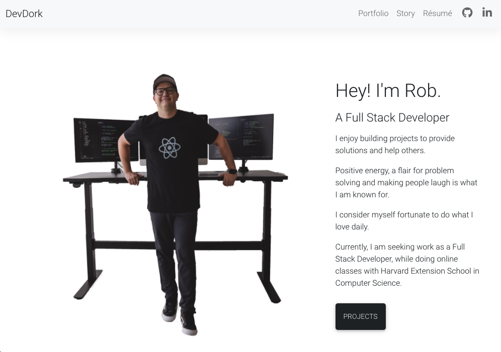
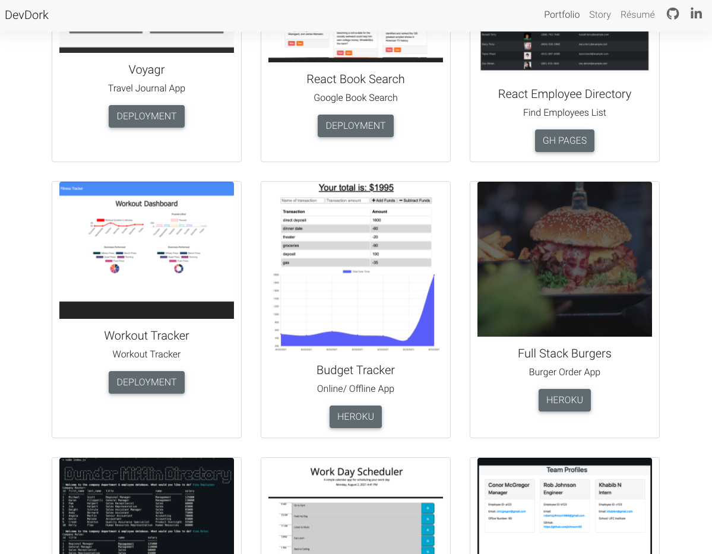

  <h1 align="center"><a href="https://www.devdork.com/"> React Portfolio 📈</a></h1>

  ## Description 
  React Portfolio website that showcases various projects, information about myself, how to contact me and my current resume.

  [](https://github.com/johnsonr84)
  [](https://github.com/johnsonr84/react-portfolio)
  [](https://github.com/johnsonr84/react-portfolio)
  [](https://choosealicense.com/licenses/mit/)
  [](https://nodejs.org/en/)
  [](https://www.npmjs.com/package/inquirer)

  ## Built With
  [](https://reactjs.org/)
   [](https://reactrouter.com/)

  ## Table of Contents 
  * [Description](#Description)
  * [Project URL](#Project-URL)
  * [Deployment](#Deployment)
  * [Demo/Screenshots](#Demo/Screenshots)
  * [Installation](#Installation)
  * [Usage](#Usage)
  * [Credits](#Credits)
  * [License](#License)
  * [Resources](#Resources)
  * [Contact](#Contact)
  * [Author](#Author)
  #
  
  ## Outcome
  * It is optimized for SEO and ARIA accessibility 
  * It is responsive to different screen sizes of devices such as mobile, tablet, and desktop.
  
  ## Project URL
  https://github.com/johnsonr84/react-portfolio

  ## Website Link
  * [Devdork](https://www.devdork.com/)
  * [https://johnsonr84.github.io/react-portfolio/](https://johnsonr84.github.io/react-portfolio/)

  ## Demo/Screenshots
  <table>
    <tr>
      <td>React Home Page Example</td>
    </tr>
    <tr>
      <td></td>
    </tr>
  </table>
   <table>
    <tr>
      <td>React Portfolio Example</td>
    </tr>
    <tr>
      <td></td>
    </tr>
  </table>

  ## Technologies 
  ```
  React, React Router Dom, React Router, React Router Hash Link, ReactStrap, Bootstrap, Javascript
  ```

  ## Installation 
  * Access to GitHub.com and a code editor such as vscode is necessary
  * Go to [https://github.com/johnsonr84/react-portfolio](https://github.com/johnsonr84/react-portfolio)
  * Click on the green button that says Clone or Download
  * Choose how you would like to download: using the SSH/HTTPS keys or download the zip file
  * Using SSH/HTTPS Key: You will copy the link shown and open up either terminal (mac: pre-installed) or gitbash (pc: must be installed). Once the application is open, you will type git clone paste url here. Once you have cloned the git repo, cd into the repo and type open. to open the folder which contains all files used for the website. Once inside the folder, click on index.html to open the website in the browser.
  * Using Download ZIP: Click on Download Zip. Locate the file and double click it to unzip the file. Locate the unzipped folder and open it. All the files for the website will be within this folder. Click on index.html to open the website in the browser.

  ## Credits 
  I would like to creadit the University of Utah Coding Bootcamp for teaching me the skills necessary to complete this wonderful portfolio and the various project contained on the portfolio page.  

  ## License 
  This project is [mit](https://choosealicense.com/licenses/mit/) licensed.

  ## Resources
  * [Choose a License](https://choosealicense.com/)
  * [Badmath](https://img.shields.io/github/languages/top/nielsenjared/badmath)
  * [shields.io](https://shields.io/)
  * [w3schools](https://www.w3schools.com/)
  * [stackoverflow.com](https://stackoverflow.com/)
  * [YouTube](https://www.youtube.com/)
  * [React.js](https://reactjs.org/)
  * [Reactstrap](https://reactstrap.github.io/)
  * [React Router documentation on HashRouter](https://reactrouter.com/web/api/HashRouter)
  * [Create React App docs for deployment.](https://create-react-app.dev/docs/deployment/#github-pages)
  * [GitHub note on client-side routing](https://create-react-app.dev/docs/deployment/#notes-on-client-side-routing)
  * [Components and Props](https://reactjs.org/docs/components-and-props.html#es6-classes)
  * [State and Lifecycle](https://reactjs.org/docs/state-and-lifecycle.html)
  * [19-React-Activities](19-React-Activities)
  * [20-State-Activities](20-State-Activities)
  * [gh-pages](https://www.npmjs.com/package/gh-pages)


  ## Contact
  Email: robertcjohnson1984@gmail.com 

  ## Author
  Author(s): Rob Johnson  
  GitHub: https://github.com/johnsonr84/ 
